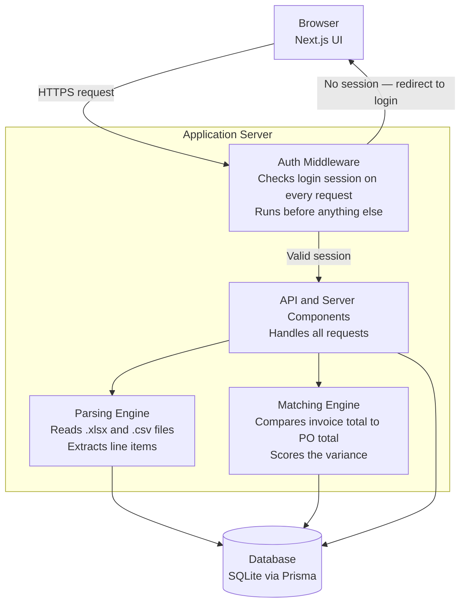
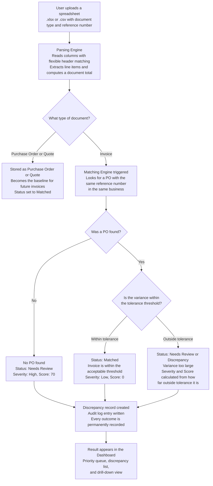
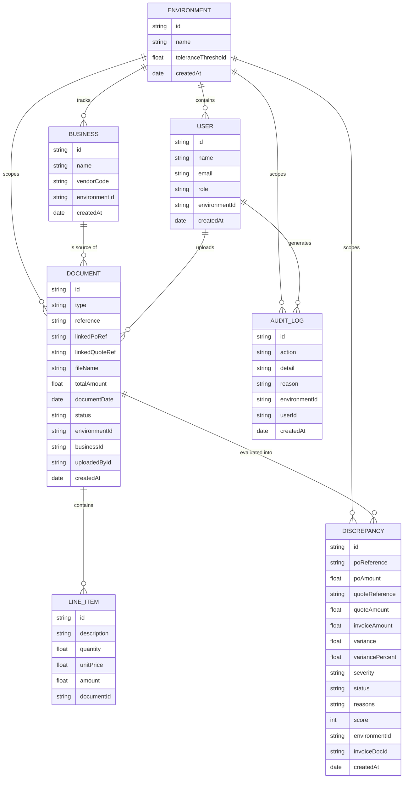

# Ghost Invoice Hunter — Project Overview

## The Billion-Dollar Blind Spot in Every Business

Every year, companies around the world lose staggering sums of money — not to clever hackers or complex fraud rings — but to a mundane, invisible problem: **invoices that get paid without anyone properly checking them.**

The numbers are striking. According to the **AFP 2025 Payments Fraud and Control Survey**, **79% of organisations worldwide** experienced actual or attempted payment fraud in 2024. The average successful invoice fraud case costs a business **$133,000**. For many mid-sized companies, annual cumulative losses from invoice scams and overpayments exceed **$1 million** — year after year. And this is not a niche problem: payment fraud across the European Economic Area alone reached **€4.2 billion in 2024**.

The root cause is almost always the same: **manual reconciliation.** Someone is supposed to check whether the invoice matches the purchase order. Often, at volume, nobody does — or they do it too fast to catch the difference.

> **Ghost Invoice Hunter is built specifically to close that gap — automatically, before a single payment goes out.**

---

## The Operational Cost of Doing This by Hand

Manual invoice processing is expensive in ways that go beyond fraud losses. Industry research consistently shows:

| What Gets Measured | Manual Process | With Automation | Improvement |
|---|---|---|---|
| **Cost per invoice processed** | $12.88 — $19.83 | $1 — $3 | **~80% reduction** |
| **Average processing time** | 14 — 18 days | ~3 days | **~75—80% faster** |
| **Invoice error rate** | Up to 39% | Under 2% | **Up to 95% fewer errors** |
| **Invoices handled per employee per year** | ~6,000 | ~23,000 | **~4x more throughput** |
| **First-time match rate (no manual correction needed)** | Low | 97—99% | **Near-perfect accuracy** |
| **Month-end close time** | Baseline | 25—40% shorter | **Days saved every month** |

*Sources: AFP 2025 Payments Fraud Survey; IOFM; Factura.ai; HighRadius; Hyland AP Automation Research.*

These are not projections — they are published benchmarks from organisations that have already made the switch from manual to automated AP reconciliation. The question is not whether automation improves outcomes. It does, reliably, across every metric that matters.

---

## What This System Does

Ghost Invoice Hunter is a web application that automates one of the most tedious and error-prone tasks in financial operations: **checking that what a vendor billed you actually matches what you agreed to pay.**

It accepts invoice, purchase order, and quote spreadsheets uploaded by your team, compares them automatically, and surfaces anything that does not add up — before a payment goes out, not after.

---

## The Problem It Solves

Businesses that process large numbers of vendor invoices often reconcile them by hand: someone opens the invoice, opens the purchase order, and eyeballs whether the numbers match. At low volume this is manageable. At real volume, it breaks down — mismatches get missed, overpayments slip through, and by the time anyone notices, the money is already gone.

Three things make this worse in practice:

- **Vendors send data in their own format.** You cannot assume a consistent, clean input — every vendor’s spreadsheet looks slightly different.
- **The person checking the invoice is often not the person who raised the purchase order.** Context gets lost between departments, or between a company and its suppliers.
- **There is no audit trail.** If a discrepancy was caught and approved anyway, there is rarely a clean record of who signed off and why.

---

## How It Helps Businesses

- **Catches overpayments before they happen.** Any invoice that exceeds its purchase order by more than an acceptable margin is flagged automatically, with the exact variance and a plain-English reason — before anyone processes payment.
- **Removes manual cross-checking.** Upload a spreadsheet; the system reads it, totals it, and matches it against the right purchase order by reference number. No one has to manually cross-reference two documents.
- **Keeps every business’s data completely separate.** Each organisation operates inside its own closed environment — nothing is ever visible or queryable across two different clients’ data.
- **Gives every action a paper trail.** Every upload, approval, settings change, and new team member is logged automatically — useful for internal accountability and external audits.
- **Scales past what a spreadsheet-and-email process can handle.** An automated first pass that only escalates the invoices that actually need a human is the difference between reconciliation being a bottleneck or not.

---

## Who It Is For

- A business with an accounts payable team processing enough vendor invoices that manual reconciliation is a genuine bottleneck.
- A large organisation tracking invoices across multiple internal departments, where each department’s spend needs to be reconciled against its own purchase orders.
- A company that processes invoices on behalf of other businesses (e.g. a bookkeeping or AP-as-a-service provider) and needs each client’s data kept in a fully separate, closed environment.

---

## System Overview

At its core, the system has one job: **take a document, extract what it says it costs, and compare that against a known baseline.** Everything else — accounts, roles, environments — exists to make that comparison trustworthy and to keep one organisation's numbers from ever touching another's.

### The Core Design Decision: Environments

Every user belongs to exactly **one Environment** — a closed, isolated silo. There is no way for a user to see or query data from another environment. Inside an environment, the account owner (the **Master** user) manages the team and tracks any number of **Businesses** (vendors, departments, or clients). Isolation is baked into the data structure itself, not just enforced by a query filter.

---

## Architecture Diagram

> **How the pieces connect:** The browser sends requests through an authentication gate. Only verified, logged-in users get through. Once authenticated, requests go to the relevant part of the application — parsing, matching, or data retrieval — all of which read and write to a single database.

---

## The Reconciliation Pipeline

> **Step by step:** what happens from the moment someone uploads a file to the moment a result appears in the dashboard.

---

## Data Model and Relationships

> **Think of these as the filing cabinets:** every piece of information the system stores lives in one of these tables, and the lines between them show how they connect.

### How the Tables Relate — In Plain English

| Relationship | What it means |
|---|---|
| **Environment to User** | Every user belongs to exactly one environment. Users cannot move between environments — isolation is structural. |
| **Environment to Business** | Businesses (vendors, departments, clients) are tracked inside an environment. They are not separate tenants. |
| **Environment to Document** | Every document (invoice, PO, quote) is scoped to an environment. You can never see another environment's documents. |
| **Business to Document** | Every document is linked to a specific business. This is how the matching engine knows which PO belongs to which vendor. |
| **User to Document** | Every document records who uploaded it — part of the audit trail. |
| **Document to Line Item** | A document holds many line items (one per row in the spreadsheet). They are stored individually so the system can later support line-item-level matching without a schema change. |
| **Document to Discrepancy** | When an invoice is processed, a Discrepancy record is always created — even if the result is Matched. It captures the full comparison: invoice amount, PO amount, quote amount, variance, severity, and the reasons in plain English. |
| **Environment to Audit Log** | Every significant action (upload, settings change, user added) creates an audit log entry scoped to the environment. |
| **User to Audit Log** | Audit log entries record which user triggered the action. |

---

## Data Flow Diagram

> **End-to-end journey:** from a user logging in to a discrepancy appearing in the dashboard. This shows both the data moving through the system and the decisions being made along the way.

```mermaid
flowchart LR
    subgraph User["User"]
        U1["Logs in"]
        U2["Uploads spreadsheet\nwith document metadata"]
        U3["Views dashboard\nand discrepancies"]
    end

    subgraph Auth["Authentication Layer"]
        A1["Verify email and password\nbcrypt hash comparison"]
        A2["Issue JWT token\n7-day session cookie\nhttpOnly and secure"]
        A3["Middleware checks token\non every request"]
    end

    subgraph Ingest["Document Ingestion"]
        I1["Validate file type,\nreference number, business"]
        I2["Parsing Engine\nReads .xlsx or .csv\nFlexible column-header matching"]
        I3["Compute document total\nfrom line item amounts"]
        I4["Save Document and Line Items\nto database"]
        I5["Write upload\naudit log entry"]
    end

    subgraph Match["Matching Engine — Invoices only"]
        M1["Look up PO by linkedPoRef\nbusinessId and environmentId"]
        M2["Look up Quote if linked"]
        M3["Calculate variance\nInvoice minus PO divided by PO"]
        M4{"Within tolerance?"}
        M5["Status: Matched\nSeverity: Low, Score: 0"]
        M6["Status: Needs Review\nor Discrepancy\nSeverity and Score from variance"]
        M7["Save Discrepancy record\nwith plain-English reasons"]
        M8["Update Document status"]
        M9["Write match result\naudit log entry"]
    end

    subgraph DB["Database"]
        D3["Documents and Line Items"]
        D4["Discrepancies"]
        D5["Audit Logs"]
    end

    subgraph UI["Dashboard"]
        R1["Summary metrics\nTotal, Matched percentage, Flagged"]
        R2["Priority queue\nFlagged invoices ordered by score"]
        R3["Discrepancy detail\nInvoice vs PO side-by-side"]
        R4["Audit log\nWho did what and when"]
    end

    U1 --> A1 --> A2 --> A3
    A3 --> U2
    U2 --> I1 --> I2 --> I3 --> I4 --> I5
    I4 --> D3
    I5 --> D5
    I4 -->|"If Invoice"| M1
    M1 --> D3
    M1 --> M2 --> M3 --> M4
    M4 -->|"Yes"| M5
    M4 -->|"No"| M6
    M5 --> M7
    M6 --> M7
    M7 --> D4
    M7 --> M8 --> D3
    M8 --> M9 --> D5
    D3 --> R1
    D4 --> R2
    D4 --> R3
    D5 --> R4
    R1 --> U3
    R2 --> U3
    R3 --> U3
    R4 --> U3
```

---

## Project Details

### Roles Inside an Environment

Every user has one of four roles, enforced server-side on every API request.

| Role | What they can do |
|---|---|
| **MASTER** | Everything. Created automatically when a new environment is registered. Cannot be deleted. |
| **ADMIN** | Add and manage users; manage tracked businesses; change environment settings such as the tolerance threshold. |
| **UPLOADER** | Upload documents (invoices, purchase orders, quotes). View results. |
| **VIEWER** | Read-only access to invoices, discrepancies, and reports. Cannot upload or change settings. |

### Discrepancy Scoring — How It Works

Matching happens at the **document total** level (invoice total vs PO total), not per line item:

| Situation | Status | Severity | Score |
|---|---|---|---|
| No matching PO found | Needs Review | High | 70 |
| Variance at or below tolerance threshold | Matched | Low | 0 |
| Variance above tolerance, at or below 3x tolerance | Needs Review | Low / Medium / High* | Up to 100 |
| Variance above 3x tolerance | Discrepancy | Low / Medium / High* | Up to 100 |

*Severity within the flagged range is determined by the variance percentage:
- Below 8% — Low
- 8 to 15% — Medium
- Above 15% — High

The **score** is `min(100, round(abs(variancePercent) x 4))` — a linear scale so the priority queue surfaces the worst invoices first.

**Quote vs PO check:** If a quote is present and the PO total differs from the quote total by more than $0.01, an additional plain-English reason is added: "PO baseline differs from the original quote by $X.XX". This catches cases where price changed between quoting and ordering.

Line items are stored per document, so upgrading to true line-item matching later is a targeted change to the matching engine only — no schema migration required.

### Tech Stack

| Layer | Technology | Notes |
|---|---|---|
| **Frontend and backend** | Next.js (App Router) and TypeScript | Server components fetch from the database directly — no separate API layer needed for page renders |
| **Styling** | Tailwind CSS | Utility-first; design tokens via CSS custom properties |
| **Database** | SQLite via Prisma ORM | Right-sized for a single VM; Prisma makes it swappable for PostgreSQL if horizontal scaling is ever needed |
| **Authentication** | JWT in an httpOnly cookie | Verified at the edge in middleware — every request is authenticated before reaching application code. Sessions expire after 7 days. |
| **Password hashing** | bcryptjs (cost factor 10) | One-way hash — the database never stores raw passwords |
| **Rate limiting** | In-memory map on the login endpoint | Locks out an IP and email pair after 5 failed attempts for 15 minutes |
| **File parsing** | SheetJS (xlsx) | Reads .xlsx and .csv; heuristic column-name matching tolerates spreadsheets with non-standard headers |
| **Input validation** | Zod | All API inputs are validated by schema before any database access |
| **Deployment** | Docker and nginx reverse proxy on Azure VM | Single docker compose up brings everything up. SQLite lives in a named Docker volume so it survives restarts. |

### Application Pages

| Route | What it does |
|---|---|
| `/` | Command Centre — summary metrics, priority queue of flagged invoices, automated insights |
| `/invoices` | Full list of all invoices with status and variance |
| `/invoices/[id]` | Invoice detail — line items, side-by-side comparison with matched PO, discrepancy reasons |
| `/purchase-orders` | All purchase orders on file |
| `/quotes` | All quotes on file |
| `/discrepancies` | Filtered view of all flagged items |
| `/reports` | Aggregate reporting views |
| `/vendors` | List of tracked businesses (vendors and departments) |
| `/team` | Team management — add users, change roles (MASTER and ADMIN only) |
| `/settings` | Environment settings — tolerance threshold (MASTER and ADMIN only) |
| `/audit-log` | Full chronological audit log for the environment |
| `/upload` | Document upload form |
| `/login` | Login page (public) |
| `/signup` | New environment registration (public) |

### Deployment

The application is Dockerized and designed to run on a single VM. The Docker setup:

1. **Build stage** — installs dependencies, generates the Prisma client, compiles the Next.js app.
2. **Runner stage** — a minimal Alpine Linux image running the compiled app as a non-root nextjs user. npm and npx are removed from the final image to reduce attack surface.
3. **Data persistence** — SQLite lives in a Docker named volume (`app-data` at `/app/data`), so the database survives container restarts and redeployments.
4. **Startup** — `docker-entrypoint.sh` runs `prisma db push` (applies schema changes) and optionally seeds initial data before starting the Next.js server on port 3001.

Required environment variables:
- `DATABASE_URL` — path to the SQLite file, e.g. `file:/app/data/sqlite.db`
- `JWT_SECRET` — a strong random string used to sign and verify session tokens

Note: nginx is included as a reverse proxy but TLS certificate issuance is a manual step once a domain is pointed at the VM.

### Deliberately Out of Scope for This Version

- **Line-item-level matching** — current matching is document-total only. Line items are stored, so upgrading is a change to the matching engine, not a schema migration.
- **Automated tests and CI/CD pipeline**
- **TLS automation** — nginx is in place; certificate issuance is a manual step once a domain is pointed at the VM.
- **Password reset and email verification flows**
- **Persistent rate limiting** — the current in-memory login rate limiter resets on server restart.

These are the natural next phases once the core reconciliation loop has been used against real business data and the matching rules have been tuned against real false positives and negatives.
