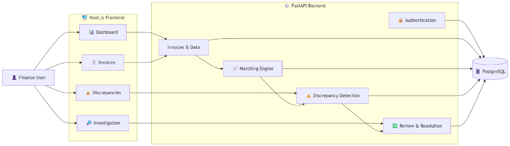
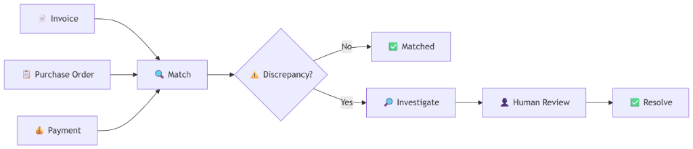

# Ghost Invoice Hunter

Find the money hiding in your financial records.

Ghost Invoice Hunter is a financial reconciliation platform designed to help businesses identify invoice, purchase order, and payment discrepancies that can lead to revenue leakage.

Instead of relying entirely on manual reconciliation, the platform brings financial records together, compares them, highlights potential problems, and gives finance teams a clear workflow for investigating and resolving them.

## What Problem Are We Solving?

Businesses deal with thousands of financial transactions.

Sometimes, the numbers don't line up:

An invoice charges more than the approved purchase order.
An invoice contains the wrong quantity.
A payment only partially covers an invoice.
The same invoice may have been submitted twice.
An invoice may have no corresponding payment.
An invoice may reference the wrong purchase order.

These issues can be difficult to spot when people are manually checking large amounts of financial data.

Even a small discrepancy can become significant when it happens repeatedly.

Ghost Invoice Hunter aims to answer one simple question:

"Where is money being lost or put at risk because our financial records don't match?"

🔍 How It Works

At its core, the system compares three important pieces of financial information:

             📋 Purchase Order
                    │
                    │
                    ▼
📄 Invoice ───► 🔍 Matching ◄─── 💰 Payment
                    │
                    ▼
             ⚠️ Discrepancy?
                /       \
              No         Yes
              │           │
              ▼           ▼
          ✅ Matched   🔎 Investigate
                           │
                           ▼
                      👤 Human Review
                           │
                           ▼
                      ✅ Resolution

The idea is simple:

Find the problem → explain the problem → let a person investigate → record the resolution.

The system is designed to assist finance teams, not replace their judgment.

👤 Who Is This For?

Ghost Invoice Hunter is primarily designed for people working with financial reconciliation, such as:

Finance analysts
Accounts receivable teams
Finance managers
Financial controllers
Operations teams

A finance user should be able to open the application and quickly understand:

💰 How much money is at risk?

⚠️ How many issues need attention?

🔎 Which issues are most important?

📋 What caused them?

✅ What has already been resolved?
🏗️ System Architecture

The first version intentionally keeps the architecture simple.

👤 User
   │
   ▼
🖥️ Next.js Frontend
   │
   ▼
⚙️ FastAPI Backend
   │
   ▼
🗄️ PostgreSQL Database
Application Architecture

Core Financial Reconciliation Flow

✨ What Can the Platform Do?

The initial version focuses on the core reconciliation workflow.

🔐 Authentication

Secure access for authorized finance users.

🏢 Organizations

Financial information is separated by organization so that one organization cannot access another organization's records.

🧾 Invoices

Store and manage invoice information including:

Invoice number
Customer
Purchase order
Invoice date
Due date
Amount
Status
📋 Purchase Orders

Store the approved financial information used to validate invoices.

💰 Payments

Compare payments against invoices to identify:

Partial payments
Overpayments
Missing payments
Outstanding invoices
🔍 Matching

Connect invoices, purchase orders, and payments and compare their information.

⚠️ Discrepancy Detection

Identify issues such as:

Issue	Example
Price mismatch	Invoice price differs from PO
Quantity mismatch	Invoice quantity differs from PO
Total mismatch	Financial totals don't reconcile
Duplicate invoice	Potential duplicate
Partial payment	Payment is less than invoice
Overpayment	Payment exceeds invoice
Missing payment	No payment found
Overdue	Invoice has passed its due date
🔎 Investigation

Finance users can inspect the evidence behind a discrepancy.

✅ Resolution

Users can review, approve, reject, or resolve discrepancies while maintaining an audit trail.

📊 The Dashboard

The Dashboard acts as the financial command center.

It will provide a high-level view of:

┌─────────────────────────────────────────────┐
│              REVENUE AT RISK               │
│                 $384,720                   │
└─────────────────────────────────────────────┘

┌───────────────┐ ┌───────────────┐
│ Open Issues   │ │ Recoverable   │
│     247       │ │   $142,350    │
└───────────────┘ └───────────────┘

The Dashboard is designed to help users move from:

Overview → Problem → Investigation → Resolution

rather than forcing users to manually search through every transaction.

🧠 A Human-in-the-Loop Approach

Ghost Invoice Hunter is designed around an important principle:

Automation should assist financial decisions, not hide them.

The system can identify a discrepancy and explain why it was flagged.

For example:

⚠️ PRICE MISMATCH

Purchase Order:   $21,000
Invoice:          $22,500

Difference:       $1,500

Reason:
The invoice unit price is higher than
the approved purchase order price.

A finance professional can then investigate the issue and decide what should happen.

This makes the system more transparent and explainable.

🤖 AI and Future Intelligence

AI may eventually assist with areas such as:

document information extraction
identifying similar records
explaining discrepancies
drafting investigation summaries
identifying unusual patterns

However, AI should not become the source of truth for financial calculations.

Financial calculations should remain deterministic and auditable.

For example:

Purchase Order
      +
Invoice
      +
Payment
      ↓
Deterministic Financial Calculation
      ↓
Financial Difference
      ↓
AI can help explain the result
🛠️ Technology

The initial application is being built with:

Layer	Technology
Frontend	Next.js
Language	TypeScript
UI	React
Backend	FastAPI
Backend Language	Python
Database	PostgreSQL
API	REST
Development	Docker / Docker Compose

The architecture will remain intentionally simple until the product requires additional infrastructure.

📦 Project Scope
✅ Initial Version

The first implementation focuses on:

User authentication
Organizations
Financial records
Invoices
Purchase orders
Payments
Matching
Discrepancy detection
Financial impact
Investigation
Human review
Resolution
Audit history
Dashboard
Automated testing
🚧 Not Part of the First Version

The following are intentionally outside the initial implementation:

Mobile application
Microservices
Kubernetes
Complex distributed infrastructure
Large numbers of external integrations
Autonomous financial decisions
Autonomous payment processing
Advanced machine-learning models
Enterprise SSO
Production financial data

These can be considered once the core product is working.