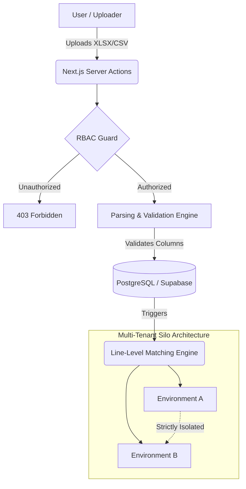

# Ghost Invoice Hunter 👻 🕵️‍♂️

**Ghost Invoice Hunter is an agentic, multi-environment engine that automatically flags billing discrepancies across Purchase Orders, Quotes, and Invoices to protect your bottom line.**

[](https://github.com/PrinceBadru/ghost-invoice-hunter/actions)
[](https://opensource.org/licenses/MIT)
[](https://nextjs.org/)

[](https://ghost-invoice-hunter.vercel.app)

> **Demo Credentials:**
> - **Email:** `sarah@acme.test`
> - **Password:** `password123`

---

## 📸 Product Preview

| Dashboard & Overview | Discrepancy Highlighting | Interactive Resolution |
|:---:|:---:|:---:|
|  <br> *A high-level view of all processed documents across the environment.* |  <br> *Line-level 3-way matching flagging over-billed items in red.* |  <br> *Actionable workflows to Request Correction or Reject invoices.* |

*(Note: Add screenshot images named `screenshot-dashboard.png`, `screenshot-discrepancy.png`, and `screenshot-resolution.png` to the `/public` folder).*

---

## 🏗 Architecture & Tenant Isolation


```mermaid
graph TD
    A[User / Uploader] -->|Uploads XLSX/CSV| B(Next.js Server Actions)
    B --> C{RBAC Guard}
    C -->|Unauthorized| D[403 Forbidden]
    C -->|Authorized| E[Parsing & Validation Engine]
    E -->|Validates Columns| F[(PostgreSQL / Supabase)]
    F -->|Triggers| G(Line-Level Matching Engine)
    
    subgraph Multi-Tenant Silo Architecture
        G --> H[Environment A]
        G --> I[Environment B]
        H -.->|Strictly Isolated| I
    end
```

### Security & Isolation Notes
- **Strict Environment Silos:** Every user and business entity belongs to a single, isolated `Environment`. The database schema enforces that no data can be queried or joined across different environments.
- **Role-Based Access Control (RBAC):** All mutating API routes and Server Actions are guarded by strict role verifications (`MASTER`, `ADMIN`, `UPLOADER`, `VIEWER`).

---

## 🔍 Line-Level Matching Examples

The matching engine doesn't just look at total amounts; it inspects every individual line item for discrepancies.

| Scenario | PO Value | Invoice Value | Outcome / Flag |
|----------|----------|---------------|----------------|
| **Perfect Match** | 10 Laptops @ $1000 | 10 Laptops @ $1000 | ✅ `Matched` (No variance) |
| **Quantity Over-billed** | 5 Monitors | 7 Monitors | ❌ `Quantity over-billed on "Monitors"` |
| **Price Variance** | $50 per Mouse | $65 per Mouse | ❌ `Unit price variance (exceeds tolerance)` |
| **Missing PO Line** | - | $150 "Consulting" | ❌ `Missing PO line: Billed for "Consulting"` |
| **Duplicate Invoice** | Invoice #123 on Jan 1 | Invoice #123 on Jan 1 | ❌ `Possible duplicate invoice detected` |

---

## 🚀 Getting Started

### Local Development

1. **Install Dependencies:**
   ```bash
   npm install
   ```
2. **Setup Database (Requires PostgreSQL/Supabase):**
   ```bash
   # Push schema to DB and seed demo data
   npm run db:push
   npm run db:seed
   ```
3. **Run the App:**
   ```bash
   npm run dev
   ```
   Navigate to `http://localhost:3000` and login with the demo credentials above.

### Testing & Linting

```bash
npm test             # Run the Vitest component & matching test suite
npm run lint         # Run Biome linting & formatting checks
```

